# Visit Järbo

## Introduction

### Project Description

[Visit Järbo](https://claudiainsweden.github.io/visit-jarbo/) is a site that provides information to travelers about what to expect when coming to Järbo.

Its vicinity to the ski resort Kungsberget makes the small town of Järbo an ideal place to stay for travelers who want to avoid the overcrowded area of Kungsberget. Järbos surroundings make it an ideal place to stay when visitors want to take a rest from their hectic everyday life.

### Project Purpose

There are are couple of international companies in the area and their employees and business partners are potential visitors who do need information about the place in English.

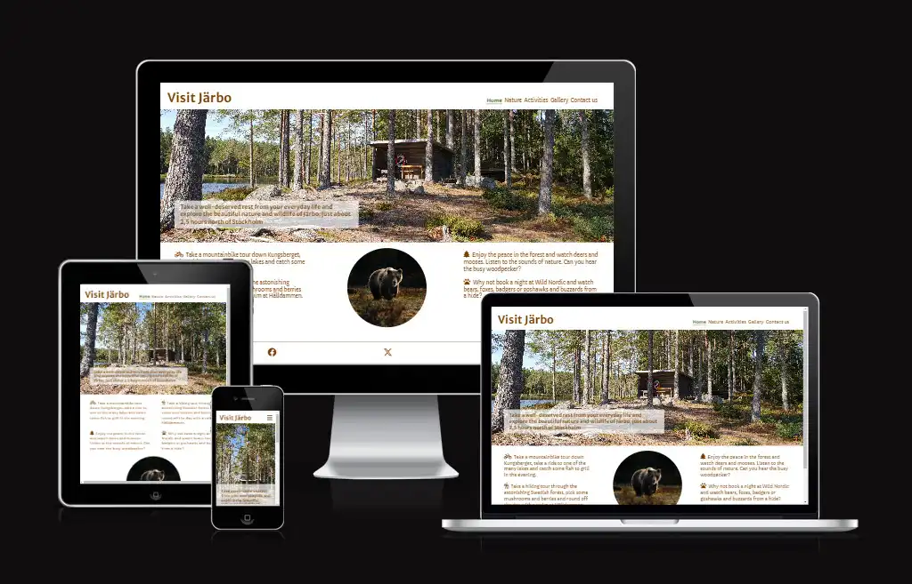

## User stories

User story: As a visitor, I want to know what I can expect in Järbo so that I can decide if I travel there or not.

End user goal: Visitor finds information about Järbo.

End business goal: The visitor travels to Järbo.

User story: As a visitor, I want to see images from the area so that I get a feeling if I would enjoy a stay there or not.

End user goal: Visitor can look at images from the area.

End business goal: The visitor travels to Järbo.

User story: As a visitor, I want to know what I can do during my stay there so that I can plan my trip.

End user goal: Visitor finds information about activities that can be done in the area.

End business goal: The visitor travels to Järbo.

User story: As a visitor, I want to know where I can find more information about the location.

End user goal: The visitor can get more information via external links or request more information via the contact us form.

End business goal: The visitor travels to Järbo.

## Features

### Navigation

- The responsive navigation bar on top of the page includes links to the Home, Nature, Activities, Gallery and Contact us page. The Visit Järbo logo is linked to the Start page. The navigation bar is identical on each page to enable easy navigation.
- It allows users to navigate between pages on all devices without the need to use the "back" button.

### Home

The Home page is the starting point for users. It provides a short overview of what Järbo has to offer

View Home Page

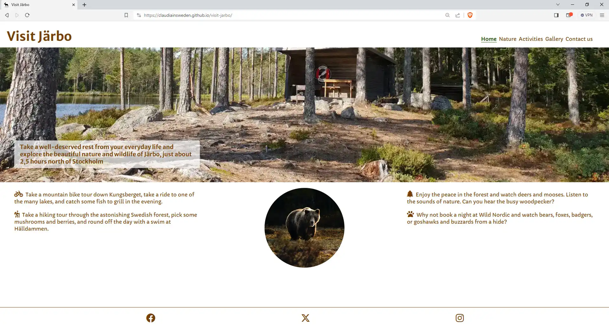

### Nature

The Nature page describe in short what the user can expect being outdoors in the area.

View Nature Page

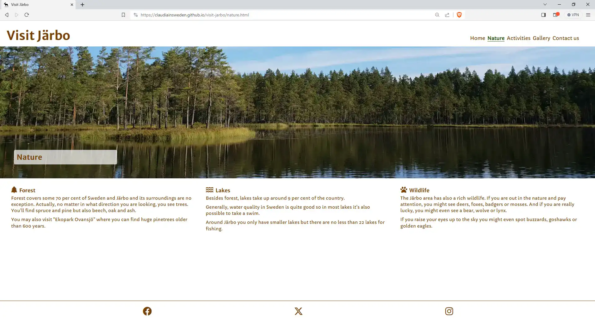

### Activities

The Activities page describes in short what kind of outdoor activities the user can enjoy.
There are also links to external information pages and service providers. The links open in a new tab to allow easy navigation without the need to use the back-button.

View Activities Page

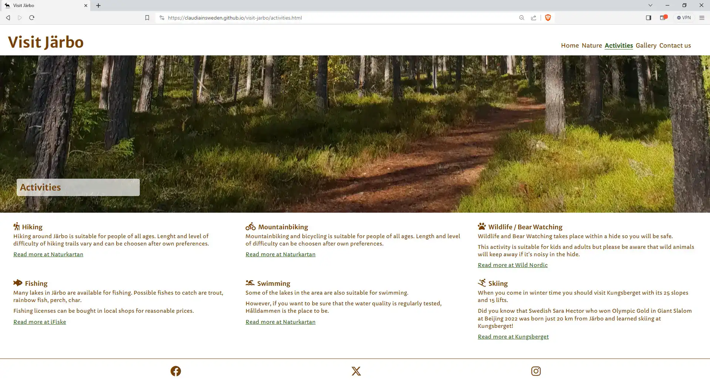

### Gallery

The Gallery page shows images of the area as well as wild animals that the user might be able to see during the stay.
The images include alt-tags to provide relevant information when screen readers are used.

View Gallery Page

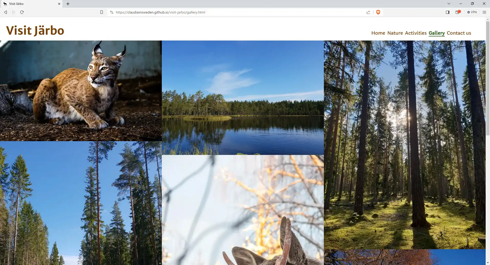

### Contact us

The Contact us page enables users to request more information about outdoor activities, listed on the activities page. It includes fields for name, email, and radio buttons to select.

View Contact us Page

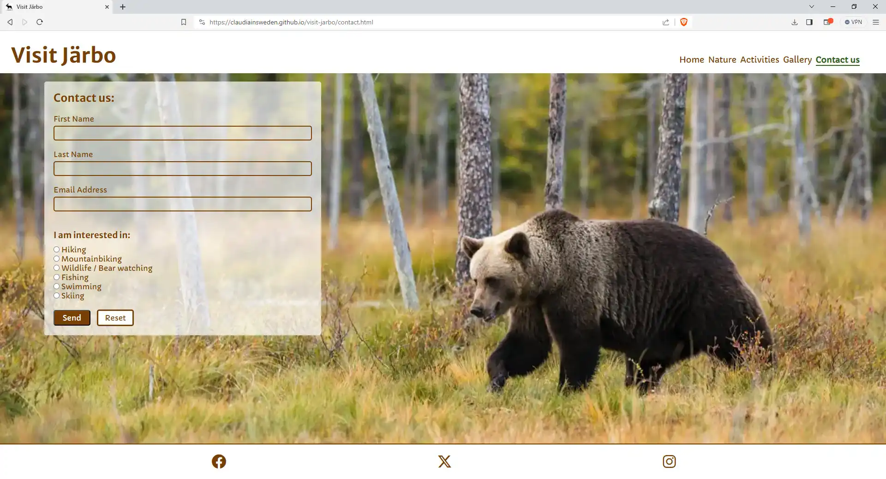

### Footer

The footer area contains links to relevant social media sites (Facebook, X (Twitter), and Instagram) to encourage users to keep connected. The icons include alternative text to provide relevant information when screen readers are used. All links open in a new tab to allow easy navigation for the user.

## Future Features

While the current version is fully functional, there are some ideas for future development:

- Include map and directions
- Add more information about the location
- Add customer review connectivity (Tripadvisor, Google, or similar)
- Add accommodation information & booking possibility
- Add more service providers
- Add live view & live weather conditions

## Typography and color scheme

The color scheme was selected to represent the prominent colors in nature: brown and green, which also harmonize very well with the images used on the site. These colors are often associated with warmth, comfort, and steadiness and are therefore well suited for a site that aims to attract people who seek recreation and nature experiences.

Typography was chosen because of its soft and rounded letters that reflect a more calm or even old-fashioned style but are easy readable.
Fonts Capriola and Merriweather from [Fontawesom](https://fontawesome.com/).

## Technology

- IDE: Code Anywhere
- Repository: GitHub
- Image editor: SnagIt
- Image converter: [Birme](<https://www.birme.net/>)
- Favicon generator:[Favicon Generator](https://favicon.io/)
  

## Testing

### Validator Testing

#### HTML

No errors were returned when passing through the [W3C Markup validator](https://validator.w3.org/).

#### CSS

No errors were found when passing through the [W3C CSS Validator](https://jigsaw.w3.org/css-validator/) validator

#### Google Chrome Lighthouse Reports

These reports presents the results of Lighthouse testing to assess the performance, accessibility, best practices and SEO of [Visit Järbo](https://claudiainsweden.github.io/visit-jarbo/index.html).

The tests were executed using the Google Chrome browser's DevTools.
All pages score very high in all areas. Details for each page can be found by clicking the expand button.
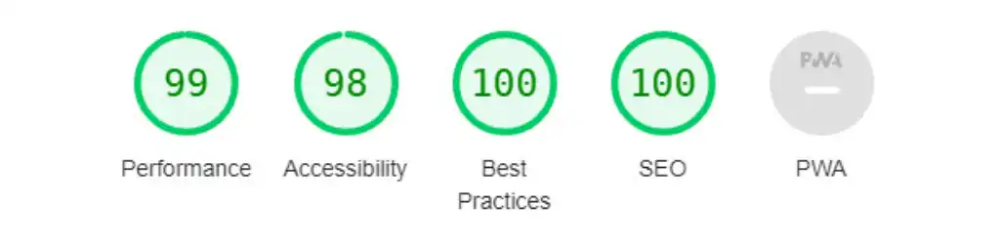

Lighthouse Report for page Home

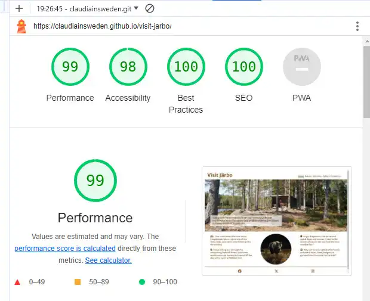

Lighthouse Report for page Nature

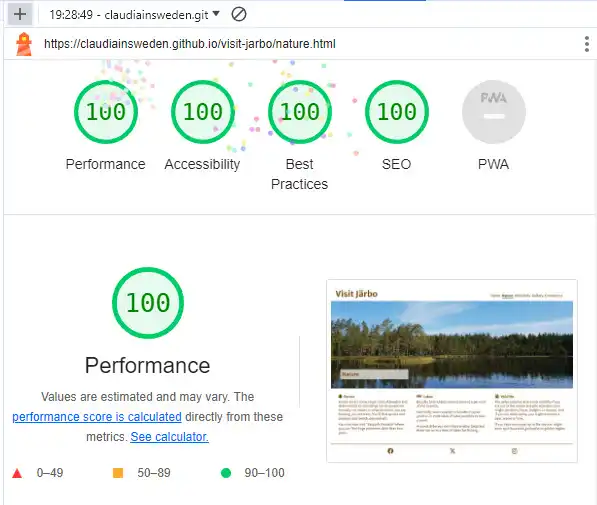

Lighthouse Report for page Activities

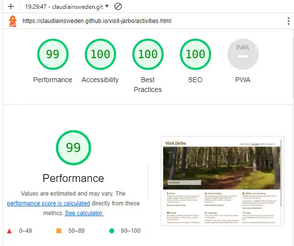

Lighthouse Report for page Gallery

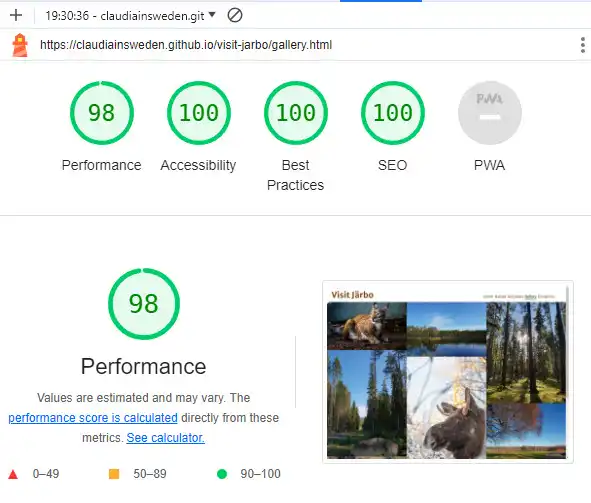

Lighthouse Report for page Contact us

### Manual Testing

#### Features Testing

| Feature  | Action |Result|
| ------------- | ------------- |-------------|
|Header|
| Logo	  | Click  | Links to Home Page|
| Navigation icon  | Click  | Opens Navigation menu |
|Navigation bar  | Click on Home  | Opens Home page |
|Navigation bar  | Click on Nature  | Opens Nature page |
|Navigation bar  | Click on Activities | Opens Activities page |
|Navigation bar| Click on Gallery  | Opens Gallery page |
|Navigation bar| Click on Contact us| Opens Contact us page |
|  |  | |
| Footer  | | |
| Social Media Section	| Click on Facebook icon |Opens Facebook in a new tab |
| Social Media Section	| Click on X icon |Opens Twitter in a new tab |
| Social Media Section	| Click on Instagram icon |Opens Instagram in a new tab |
| Pages |  |
| Activities page  | Click on Links in text  | Open links in new tab|
| Contact us page  | Click Send  |Error message if field is empty|
| Contact us page | Click on input field	|Green border and green input text |
| Contact us page  | Click on Email field and write text only |Error message to enter email address|
| Contact us page  | Click on Reset |Empties all fields |
|Contact us page  | Click on Send |Redirects to confirmation page |

## Browser Testing

Functionality, links, layout, and responsiveness were tested with the following browsers without any issues:

- Microsoft Edge Version 117.0.2045.47
- Firefox Version 118.0.1
- Brave Version 1.58.135
- Google Chrome Version 116.0.5845.188
  
## Device Testing

Functionality, links, layout, and responsiveness were tested on the following devices without any issues:

- Dell Laptop 14" / 1920px x 1080px
- HP Laptop 17" / 1920px x 1080px
- Dell Screen 24" / 1920px x 1080px
- Samsung Galaxy 22S Ultra / 3088px x 1440px
- iPhone 8 / 1334px × 750px

### Findings under testing

- As users might want to receive information about more than one topic, checkboxes were initially used on the Contact us page. However, after some trials and Google research it turned out that this feature requires Javascript which was not part of the course so far.

## Deployment

The site was deployed to GitHub pages. The steps to deploy are as follows:

- In the GitHub repository, navigate to the Settings tab
- From the source section drop-down menu, select the Main Branch
- Once the main branch has been selected, the page will be automatically refreshed with a detailed ribbon display to indicate the successful deployment.
  
The live link can be found here - <https://claudiainsweden.github.io/visit-jarbo/>

## Credits

### Content

Idea, content and text are developed by myself.

Inspiration for the layout from walkthrough project "Love Running" and default SharePoint page layouts.

- Detailed information about what kind of fish there is to catch from [iFiske](https://www.ifiske.se/en/fishing-harnen-holmsjon-langsjon-m-fl-vatten.htm).
- Information about percentage of forest in Sweden taken from [Visit Sweden](https://visitsweden.com/what-to-do/nature-outdoors/forest-bathing/).
- Information about percentage of lakes in Sweden taken from [Skogskunskap/Forest knowledge](https://www.skogskunskap.se/hansyn/vatten-och-mark/om-hansyn-till-vatten-och-mark/vatten-i-sverige/)
- Information about what animals can be seen at Wild Nordic taken from [Wild Nordic](https://wildnordic.se/en/home/)
- Icons from [Font Awesome](https://fontawesome.com/)
- Vector graphic for Favicon from [Vecteezy](https://www.vecteezy.com/)
- Fonts from [Google Fonts](https://fonts.google.com/)
- Images converted to webp with [Birme](https://www.birme.net/)

### Media

All images showing "nature only" are photos taken by myself.
Images including animals are from free sources as listed below:

- Bear images: Photo by <a href="https://unsplash.com/@zmachacek?utm_source=unsplash&utm_medium=referral&utm_content=creditCopyText">Zdeněk Macháček</a> on <a href="https://unsplash.com/photos/Pt3asvL65Mg?utm_source=unsplash&utm_medium=referral&utm_content=creditCopyText">Unsplash</a>
- Lynx image: Photo by <a href="https://unsplash.com/@hoops1972?utm_source=unsplash&utm_medium=referral&utm_content=creditCopyText">Glen Hooper</a> on <a href="https://unsplash.com/photos/8LWtpfhGP4U?utm_source=unsplash&utm_medium=referral&utm_content=creditCopyText">Unsplash</a>
- Fox image: Photo by <a href="https://unsplash.com/@vincentvanzalinge?utm_source=unsplash&utm_medium=referral&utm_content=creditCopyText">Vincent van Zalinge</a> on <a href="https://unsplash.com/photos/cHhPjhOe8LA?utm_source=unsplash&utm_medium=referral&utm_content=creditCopyText">Unsplash</a>
- Moose image: Photo by <a href="https://unsplash.com/@thejohnnyme?utm_source=unsplash&utm_medium=referral&utm_content=creditCopyText">Nikola Johnny Mirkovic</a> on <a href="https://unsplash.com/photos/VFgxrL65zNI?utm_source=unsplash&utm_medium=referral&utm_content=creditCopyText">Unsplash</a>
- Deer image: Photo by <a href="https://unsplash.com/@lassenystedtfoto?utm_source=unsplash&utm_medium=referral&utm_content=creditCopyText">Lasse Nystedt</a> on <a href="https://unsplash.com/photos/FftpQKKGxOc?utm_source=unsplash&utm_medium=referral&utm_content=creditCopyText">Unsplash</a>

### Code

Initially, a lot of the code was copied from the Walkthrough project "Love Running" and changed during the project to fit this site.

- Copied Asterisk wildcard selector from the Walkthrough project "Love Running"
- Header & navigation copied from the Walkthrough project "Love Running"
- Footer copied from the Walkthrough project "Love Running"
- Gallery copied from the Walkthrough project "Love Running"
- Contact us page copied from the Walkthrough project "Love Running"
- Index page copied from the Walkthrough project "Love Running"
  
  #### Inspiration and tutorials used from

  - [W3Schools](https://www.w3schools.com/)
  - [Mdn Web Docs](<https://developer.mozilla.org/en-US/>)
  - [Stack overflow](https://stackoverflow.com/)
  - Code Institute Slack Channel
    - Special thanks to Craig Hudson, my fellow student Niclas Hugdahl, and my mentor Rohit Sharma

  #### Templates and tutorial for creating the readme-file

  - [bezebee - My First Project](https://github.com/bezebee/My-First-Project/blob/main/README.md)
  - [Drupal Wiki](https://www.drupal.org/docs/develop/managing-a-drupalorg-theme-module-or-distribution-project/documenting-your-project/readmemd-template)
  - [GitHub Docs](https://docs.github.com/en)
